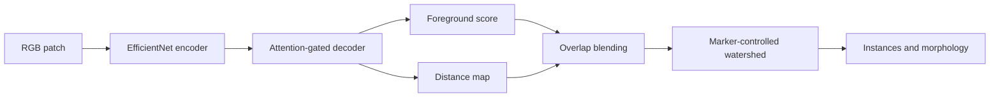

# Attn-Dist-Net

Attention-guided foreground and distance-map learning for nuclei instance segmentation in
H&E histopathology patches. This repository is a Semester 6 research project by Fayaz Saju,
Aurora Sabu Rangan, and Alan Joseph.

> Research use only. This software is not a medical device and must not be used for diagnosis,
> treatment, or patient-management decisions.

## Status

The application, training pipeline, evaluation protocol, and deployment image are implemented
and tested. A complete baseline was trained on PanNuke fold 1, selected on fold 2, and evaluated
on all 2,722 fold-3 patches. Dataset files and model checkpoints are deliberately excluded from
Git. The UI remains read-only until a strict version-2 inference checkpoint passes compatibility
validation. Runtime discovery prefers a fold-2-calibrated checkpoint when one is available and
retains the original checkpoint as the immutable reproduced baseline.

## Reproduced Baseline

| Dice | IoU | AJI+ | PQ | Detection F1 | Segmentation quality |
| ---: | ---: | ---: | ---: | ---: | ---: |
| 0.8248 | 0.7181 | 0.4811 | 0.3971 | 0.5178 | 0.7365 |

These are binary, per-image means from one held-out fold using the epoch-53 checkpoint without
test-time augmentation. They are not directly comparable to three-fold, tissue-averaged bPQ/mPQ
results from multiclass systems. Exact hashes, confidence intervals, training history, and
per-image evidence are in [docs/BASELINE.md](docs/BASELINE.md).

The measured bottleneck is instance recognition and separation rather than the shape quality of
matched nuclei. The staged, competitor-aligned response is documented in
[docs/MODEL_ROADMAP.md](docs/MODEL_ROADMAP.md).

Fold-2-only postprocessing calibration raised validation PQ from 0.40436 to 0.60285 without
changing model weights. This is development evidence, not a replacement for the held-out fold-3
baseline. Search boundaries, leakage controls, and the calibrated artifact hash are in
[docs/POSTPROCESSING.md](docs/POSTPROCESSING.md).

## Architecture

The model uses an EfficientNet encoder, attention-gated decoder, foreground head, and normalized
intra-nucleus distance head. Overlapping inference tiles are blended before marker-controlled
watershed reconstructs globally consistent instances.



## Local Setup

Python 3.10-3.13 and Node.js 20 or newer are supported. Python 3.11 and 3.12, plus Node.js 22,
are exercised in CI; the minimal production runtime uses Python 3.12.

```bash
chmod +x setup.sh
./setup.sh
```

The launcher creates local environments, selects free API/UI ports, and reports dataset and
checkpoint readiness. Other commands:

```bash
./setup.sh doctor
./setup.sh check
./setup.sh prepare-data
./setup.sh train --epochs 150 --batch-size 8 \
  --early-stopping-patience 0 --output-dir outputs_v2/e03_bounded_distance
./setup.sh train-bg --epochs 150 --batch-size 8 \
  --early-stopping-patience 0 --output-dir outputs_v2/e03_bounded_distance
./setup.sh training-status
./setup.sh evaluate
./setup.sh sbom outputs_v2/release/sbom.cdx.json
./setup.sh tune outputs_v2/checkpoints/best_iou.pt \
  --calibrated-checkpoint outputs_v2/checkpoints/best_iou_calibrated.pt
```

## Data

`./setup.sh prepare-data` streams the pinned `MedOtter/PanNuke` mirror revision and writes
memory-mapped arrays under `data/pannuke/`. Preparation requires approximately 4 GiB free.
`./setup.sh prepare-data --no-distances` requires approximately 2.7 GiB and computes distance
targets on demand during training. The resulting contract is:

```text
images.npy       uint8   [N, 256, 256, 3]
instances.npy    uint16  [N, 256, 256]
folds.npy        uint8   [N]
distances.npy    float16 [N, 256, 256] (optional cache)
manifest.json    hashes, shapes, dtypes, and fold counts
provenance.json  source revision and license
```

PanNuke is licensed CC BY-NC-SA 4.0. Its data and derived weights are non-commercial artifacts;
review the license before distributing a checkpoint.

## Reproduction Protocol

1. Run `./setup.sh check`.
2. Run `./setup.sh prepare-data` and `./setup.sh validate`.
3. Train on fold 1 with `./setup.sh train --epochs 150 --batch-size 8 --seed 42`.
4. Select `best_iou.pt` using fold 2 only.
5. Run `./setup.sh evaluate outputs_v2/checkpoints/best_iou.pt` on fold 3 once.

The evaluation summary records checkpoint SHA-256, fold protocol, runtime, settings, sample count,
metric distributions, and deterministic 95% bootstrap confidence intervals. `--limit` creates a
smoke-test artifact and is never a benchmark result.

Publish a value only with the Git commit, dataset manifest, training history, checkpoint hash,
full `summary.json`, `per_image.csv`, and hardware/runtime record. Semantic IoU must never be
renamed as an instance metric. Historical artifacts now label their one-to-one aggregate
Jaccard value as AJI+; the corrected evaluator reports classic AJI and AJI+ separately.

Method details are in [docs/METHODOLOGY.md](docs/METHODOLOGY.md). The current baseline must remain
fixed while new choices are developed on fold 2; fold 3 is not an iterative tuning set.

## Controlled Validation Tooling

The repository includes a draft protocol, SAP, metric dictionary and executable tooling for
patient/slide-aware scoring, subgroup/failure analysis, separate-cohort uncertainty calibration and
frozen CPU/GPU topology benchmarking. Start with
[the performance validation protocol](docs/medical-device/model-data/PERFORMANCE_VALIDATION_PROTOCOL.md).
These tools generate hash-bound analysis outputs that still require independent review and signed
study controls. No external, prospective, reader, repeatability or clinical-topology study has been
executed, and no generated output authorizes medical use.

## Deployment

The production container serves the compiled React workstation and FastAPI under one origin. It
refuses readiness unless the mounted checkpoint has the expected schema and exact model keys.

```bash
docker build -t attn-dist-net .
docker run --rm -p 8000:8000 \
  --read-only --tmpfs /tmp:size=256m \
  -v "$PWD/outputs_v2/checkpoints/best_iou_calibrated.pt:/models/best_iou.pt:ro" \
  attn-dist-net
```

This command starts research mode only. Controlled-operation environment, gateway trust boundary,
audit storage, release evidence, and site qualification are specified in
[docs/medical-device/DEPLOYMENT_AND_OPERATIONS.md](docs/medical-device/DEPLOYMENT_AND_OPERATIONS.md).
The fail-closed `./setup.sh release-gate` command intentionally rejects the current repository
until every accountable clinical, quality, security, legal, usability, operational, and regulatory
gate has dated approval and evidence.

`/api/live` reports process liveness; `/api/ready` returns 503 until the model is validated. Put
the service behind TLS and authentication, retain one process per accelerator, centralize logs,
scan and pin container images, and prohibit identifiable patient data.

Clinical deployment additionally requires a defined intended use, representative external and
prospective validation, subgroup and failure-mode analysis, calibration, human-factors testing,
quality-system documentation, security risk management, regulatory review, and monitoring. Those
requirements cannot be completed by repository code or a single benchmark run.

## Repository

```text
api.py          inference and reporting API
web/            React workstation
src/            model, training, inference, metrics, reporting
scripts/        pinned dataset preparation and validation
tests/          deterministic unit and API tests
```

## License

Project code is released under the MIT License. Dataset, pretrained encoder, and derived model
weights retain their own licenses and citation requirements.
